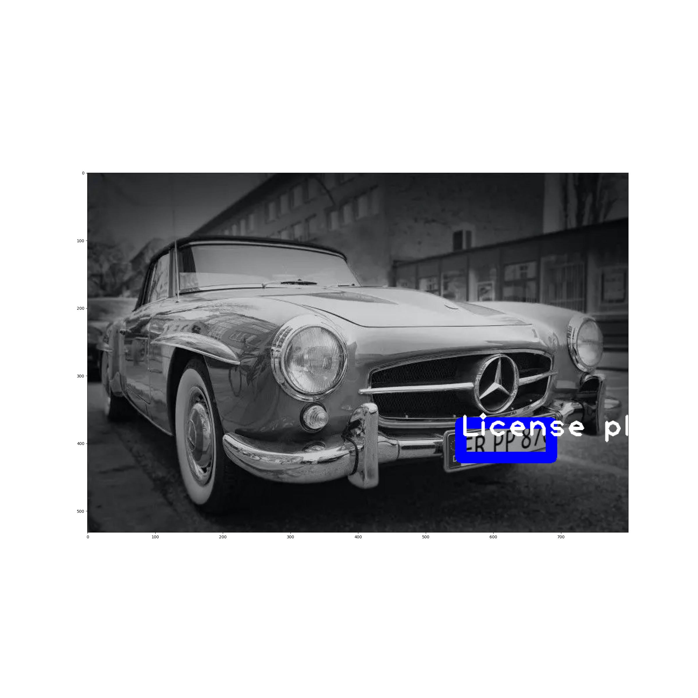
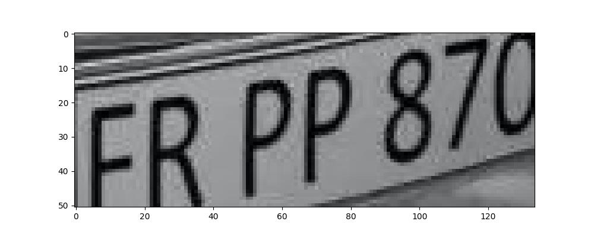

+++
title = 'Darknet 12'
summary = 'Last Result'
date = 2024-05-15T09:34:34+01:00
draft = false
tags = ['yolo', 'goal 3', 'google colab', 'jupyter notebook']
+++
While **darknet** is stuck around *360 hours left* I tested the last weights to see what it got and found that these were pretty much the same as the last ones. This means that it's noy lrstninh snything new.



And the plate itself:



With this I'll see the exercise as complete, having successfully made *Darknet YOLO* detect license plates.
In case you're wondering how the detection was done, here's the code:

```
from google.colab import drive
drive.mount('/content/gdrive', force_remount=True)

DN="/content/gdrive/MyDrive/Colab/darknet"
print(DN)

import cv2
import numpy as np
import matplotlib.pyplot as plt

class LicensePlateDetector:
  ---

lpd = LicensePlateDetector(
    pth_weights=''/content/gdrive/MyDrive/Colab/darknet/backup/yolov3-train_last.weights',
    pth_cfg='/content/gdrive/MyDrive/Colab/darknet/cfg/yolov3-train.cfg',
    pth_classes='/content/gdrive/MyDrive/Colab/darknet/data/cars/classes.txt'
)

# Plot original image with rectangle around the plate
plt.figure(figsize=(24, 24))
plt.imshow(cv2.cvtColor(lpd.fig_image, cv2.COLOR_BGR2RGB))
plt.savefig('detected.jpg')

# Crop plate and show cropped plate
lpd.crop_plate()
plt.figure(figsize=(10, 4))
plt.imshow(cv2.cvtColor(lpd.roi_image, cv2.COLOR_BGR2RGB))
plt.savefig('plate.jpg')
```
